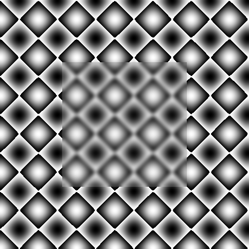

+++
title =  "Mapping data from Eigen to OpenCV and back"
date = "2014-08-16"
tags =  ["opencv", "tutorials"]
thumbnail = "post/2014-08-16-mapping-eigen-to-opencv/eigen2cv.png"
+++


Eigen is a C++ template library for matrix and vector operations. 
It is highly optimized for numeric operations and support vectorization and 
use aligned memory allocators. 

When it comes to matrix operations, Eigen is much faster than OpenCV. 
However, it can be situations when it is necessary to pass Eigen data 
to OpenCV functions. 

In this post I will show how to map Eigen data to OpenCV with easy and efficient 
way. No copy, minimal overhead and maximum syntax sugar:
<div class="clearfix"></div>

**Simple case**

```cpp
Eigen::ArrayXXd img(480, 640);
...
cv::imshow("test", eigen2cv(img));
```

Proposed approach does not limited to continuous memory layout - it support expression and blocks
as well. If given expression has to be evaluated - it will be evaluated into temporary dense storage 
and then mapped to OpenCV structure:

**Expressions**
    
```cpp
// Unsharp mask
Eigen::ArrayXXd img, blur;    
cv::GaussianBlur(eigen2cv(img), eigen2cv(blur));

cv::imshow("sharpened", eigen2cv(1.5 * img - 0.5 * blur));
```

<span class="more" />

## Idea

In fact, Eigen heavily use [C++ templates magic](#1) to create expression structures with delayed evaluation and [type traits](#2) to detect type of derived objects in compile time. 
This approach gives compiler a lot of hints on actual data layout which helps to generate more efficient code. 
The drawback of this - if you want to deep dive in Eigen internals be prepared to hardcore. 

I will use templates as well. We will have template class ``Eigen2CV`` and several specializations of this class - for planar types, for blocks, for expression and so on... 
In addition we will specialize this class with mutable specification which will 
let us to define <u>at compile time</u> whether mapped object is allowed for writing or not. Awesome.

```cpp
template<
    typename Derived, 
    typename Base, 
    typename ConstPolicy, 
    typename StorageKind = typename Eigen::internal::traits<Derived>::StorageKind 
    >
class Eigen2CV;
```

To interact with OpenCV, we can declare implicit conversion operators for ``cv::Mat``, ``cv::InputArray`` and ``cv::OutputArray``.
Some of the mapped objects can have read/write access while the rest  - read-only. 
Therefore we will introduce the base class ``Eigen2CVBase`` to provide a "read-only" access for all derived objects. 

```cpp
class Eigen2CVBase
{
public:
    
    operator cv::Mat() const
    {
        return mBody;
    }
    
    operator cv::_InputArray() const
    {
        return cv::_InputArray(mBody);
    }
    
protected:
    
    template<typename Derived>
    void mapPlaneMemory(const Derived& src)
    {
        const bool isRowMajor = int(Derived::Flags) & Eigen::RowMajorBit;
        const int stride = src.outerStride() * sizeof(typename Derived::Scalar);
        
        if (isRowMajor)
            this->mapPlaneMemoryRowMajor(src.data(),
                                         src.rows(),
                                         src.cols(),
                                         stride);
        else
            this->mapPlaneMemoryColMajor(src.data(),
                                         src.rows(),
                                         src.cols(),
                                         stride);
    }

    template <typename Scalar>
    void mapPlaneMemoryRowMajor(const Scalar* planeData, int rows, int cols, int stride)
    {
        this->mBody = cv::Mat(rows, 
                              cols, 
                              opencv_matrix<Scalar>::type, 
                              const_cast<Scalar*>(planeData), 
                              stride);
    }
    
    template <typename Scalar>
    void mapPlaneMemoryColMajor(const Scalar* planeData, int rows, int cols, int stride)
    {
        this->mBody = cv::Mat(cols, 
                              rows, 
                              opencv_matrix<Scalar>::type, 
                              const_cast<Scalar*>(planeData), 
                              stride);
    }

    template <typename Derived, typename T>
    void assignMatrix(Eigen::DenseBase<Derived>& dst, const cv::Mat_<T>& src)
    {
        typedef typename Derived::Scalar Scalar;
        typedef Eigen::Matrix<T, 
                              Eigen::Dynamic, 
                              Eigen::Dynamic, 
                              Eigen::RowMajor> PlainMatrixType;
        
        dst = Eigen::Map<PlainMatrixType>((T*)src.data, 
                                          src.rows, 
                                          src.cols).
                                          template cast<Scalar>();
    }
    
    cv::Mat mBody;
};
```

For those Eigen types that allows read/write access, we will have additional conversion operator to cv::OutputArray. By default all derived types will have read-only access.

## Mapping Eigen plain objects 

Let's start from mapping continuous block of memory represented by ``Eigen::Matrix`` of ``Eigen::Array``. 
These two classes derives from ``Eigen::PlainObjectBase`` class which provides methods to access internal storage 
buffer. 

```cpp
template<typename Derived>
class Eigen2CV<
    Derived, 
    Eigen::PlainObjectBase<Derived>, 
    details::Const> : public Eigen2CVBase
{
public:
    
    typedef typename Derived::Scalar Scalar;
    typedef Eigen2CV<Derived, Eigen::PlainObjectBase<Derived>, details::Mutable> Self;
    
    Eigen2CV(const Eigen::PlainObjectBase<Derived>& src)
    : mMappedView(src)
    {
        this->mapPlaneMemory(mMappedView);
    }
           
private:
    const Eigen::PlainObjectBase<Derived>& mMappedView;
};
```

This is ``Eigen2CV`` specialization for constant ``Eigen::PlainObjectBase`` object. This specialization of ``Eigen2CV`` can return constant reference to ``cv::Mat`` and ``cv::InputArray``. 

Now we can write two overloads of ``eigen2cv`` function for ``Eigen::Matrix`` and ``Eigen::Array``. The goal of ``eigen2cv`` is simple - take an argument and create 'right' Eigen2CV<...> mapper.
Here is how it looks like for planar data:

```cpp
template<typename E>
Eigen2CV<E, Eigen::PlainObjectBase<E>, details::Mutable> 
eigen2cv(Eigen::PlainObjectBase<E>& src) 
{
    return Eigen2CV<E, 
                    Eigen::PlainObjectBase<E>, 
                    details::Mutable
                    >(src));
}

template<typename E>
Eigen2CV<E, Eigen::PlainObjectBase<E>, details::Const>
eigen2cv(const Eigen::PlainObjectBase<E>& src) 
{
    return Eigen2CV<E, 
                    Eigen::PlainObjectBase<E>, 
                    details::Const
                    >(src);
}  
```

I want to draw your attention to how elegant C++ allows us to distinct mutable and constant objects. 
Compiler will choose right function depending on the context of ``src``. 
In case of access right conflicts you will get compile-time error.

## Assigning OpenCV matrix to Eigen object

What if someone write: 
    
```cpp
eigen2cv(a) = cv::imread("lena.jpg", cv::IMREAD_GRAYSCALE);
```

Well, it's legal and I see no problems with this code while we follow few restrictions:
1. ``data`` has dynamic size or fixed one which match cv::Mat size.
2. Image is single channel - there is no way to map multi-channel images to Eigen now.

Assignment operator is also quite simple:

```cpp
template <typename T>
Self& operator=(const cv::Mat_<T>& src)
{
    assignMatrix<Derived, T>(mMappedView, src);
    return *this;
}

/**
 * @brief Assignment operator to copy OpenCV Mat data to mapped Eigen object.
 */
Self& operator= (const cv::Mat& m)
{
    switch (m.type())
    {
        case CV_8U:  return *this = (cv::Mat_<uint8_t>)m;
        case CV_16U: return *this = (cv::Mat_<uint16_t>)m;
        case CV_16S: return *this = (cv::Mat_<int16_t>)m;
        case CV_32S: return *this = (cv::Mat_<int32_t>)m;
        case CV_32F: return *this = (cv::Mat_<float>)m;
        case CV_64F: return *this = (cv::Mat_<double>)m;
        default:
            throw std::runtime_error("Unsupported OpenCV matrix type");
    };
}
```

## Mapping Eigen expressions

Dealing with expressions is not much harder. 
Depending on the expression type, we must either evaluate it into dense storage (when it's real expression like ``AX + B``, or ``cast<float>()``) 
or use underlying storage with regards to expression operator (``block()``, ``transpose()``, ``array()``, ``matrix()``). 
We will get to mapping blocks in a next section. 

Let's map expression that require evaluation first. For the sake of simplicity, 
I will not implement write expressions, e.g expressions that require eval/update/write-back. 
Eigen2CV will be able map Eigen expressions in read-only mode. 
And here's how:

```cpp
template<typename Derived>
class Eigen2CV<Derived, Eigen::EigenBase<Derived>, details::Const> : public Eigen2CVBase
{
public:
    typedef typename Derived::Scalar Scalar;
    typedef typename Eigen::internal::plain_matrix_type<Derived>::type StorageType;

    Eigen2CV(const Eigen::EigenBase<Derived>& src)
    {
        mStorage = src; // All magic happens here
        this->mapPlaneMemory(mStorage);
    }

protected:

    void mapPlaneMemory(StorageType& src)
    {
        if ( ( StorageType::Options & Eigen::RowMajor) == Eigen::RowMajor)
            this->mapPlaneMemoryRowMajor(src.data(), 
                                         src.rows(), 
                                         src.cols(), 
                                         src.outerStride() * sizeof(Scalar));
        else
            this->mapPlaneMemoryColMajor(src.data(), 
                                         src.rows(), 
                                         src.cols(), 
                                         src.outerStride() * sizeof(Scalar));
    }

private:
    StorageType mStorage;
};
```

For the first look, it is almost the same as specialization for planar data types. A few differences make this specialization very other one. 
First, ``Eigen::internal::plain_matrix_type<Derived>::type`` type trait helps us to infer type of dense storage for given expression. 
Second, line ``mStorage = src`` looks really simple right? But hold on, ``src`` is an expression, and ``mStorage`` is dense matrix.
Assignment operator makes our like much easier by performing evaluation step inside this assignment. 

And here is ``eigen2cv`` overload for Eigen expressions:

```cpp
template<typename E>
Eigen2CV<E, Eigen::EigenBase<E>, details::Const>
eigen2cv(const Eigen::EigenBase<E>& src) 
{
    return Eigen2CV<E, 
                    Eigen::EigenBase<E>, 
                    details::Const
                    >(src);
}
```

## Mapping Eigen views

User can create sub-view for the Eigen storage using ``block()``. 
Eigen block create view that points to the same memory region, but has different size and stride. 
Blocks can be read and written. 

```cpp
template<typename Derived>
class Eigen2CV<Derived, 
               Eigen::Block<Derived>, 
               details::Mutable, 
               Eigen::Dense> : public Eigen2CVBase
{
public:
    typename Derived::Scalar Scalar;
    typedef Eigen2CV<Derived, Eigen::Block<Derived>, details::Mutable> Self;

    Eigen2CV(const Eigen::Block<Derived>& src)
        : mMappedView(src)
    {
        this->mapPlaneMemory(mMappedView);
    }
    
    operator cv::_OutputArray()
    {
        return cv::_OutputArray(this->mBody);
    }
    
    template <typename T>
    Self& operator=(const cv::Mat_<T>& src)
    {
        MatrixAssign<Derived, T>(mMappedView, src);
        return *this;
    }
    
    /**
     * @brief Assignment operator to copy OpenCV Mat data to mapped Eigen object.
     */
    Self& operator= (const cv::Mat& m) throw ()
    {
        switch (m.type())
        {
            case CV_8U:  return *this = (cv::Mat_<uint8_t>)m;
            case CV_16U: return *this = (cv::Mat_<uint16_t>)m;
            case CV_16S: return *this = (cv::Mat_<int16_t>)m;
            case CV_32S: return *this = (cv::Mat_<int32_t>)m;
            case CV_32F: return *this = (cv::Mat_<float>)m;
            case CV_64F: return *this = (cv::Mat_<double>)m;
            default:
                throw std::runtime_error("Unsupported OpenCV matrix type");
        };
    }
    
private:
    const Eigen::Block<Derived>& mMappedView;
};

template<typename E>
Eigen2CV<E, Eigen::Block<E>, details::Mutable>
eigen2cv(const Eigen::Block<E>& src)
{
    return Eigen2CV<E, 
                    Eigen::Block<E>, 
                    details::Mutable
                    >(src);
}
```

## Eigen memory organization

Eigen can use column-major or row-major ordering of internal data storage. 
By default it's column-major, but OpenCV use row-major ordering. 

<p class="info info-warning">
<span class="label label-info">Notice</span>
This mapping implementation will NOT convert underlying Eigen memory to meet OpenCV convention. 
For column-major order of Eigen data type this will lead to transposed matrices in OpenCV. 
</p>

## Demonstration

```cpp   
Image8u_t a(512, 512); // Eigen::Matrix<uint8_t, Dynamic, Dynamic>

for (size_t i = 0; i < 512; i++)
{
    for (size_t j = 0; j < 512; j++)
    {
        a(i,j) = 255.0f * (sin(0.04f * i) * sin(0.04f * i) + 
                           cos(0.04f * j) * cos(0.04f * j));
    }
}

cv::GaussianBlur(eigen2cv(a.block(128, 128, 256, 256)),
                 eigen2cv(a.block(128, 128, 256, 256)), cv::Size(25,25), 0);
cv::imshow("Blur image region", eigen2cv(a));
```



## Source code

Source code for this post can be found on GitHub: [Eigen2CV.h][source-code].

License: [BSD-3][bsd-3].

## References
    
<a name="#1" />

1. <a href="http://www.amazon.com/gp/product/0201704315/ref=as_li_tl?ie=UTF8&camp=1789&creative=9325&creativeASIN=0201704315&linkCode=as2&tag=compvisitalk-20&linkId=2ZA2JDQNEDOQJZFL">Modern C++ Design: Generic Programming and Design Patterns Applied</a>

<a name="#2" />
2. http://www.drdobbs.com/cpp/c-type-traits/184404270


 [source-code]: https://gist.github.com/BloodAxe/c94d65d5977fb1d3e53f
 [bsd-3]: https://tldrlegal.com/license/bsd-3-clause-license-(revised)#summary