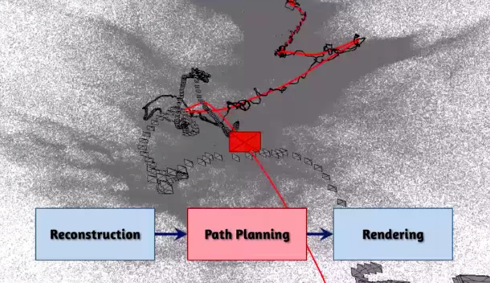
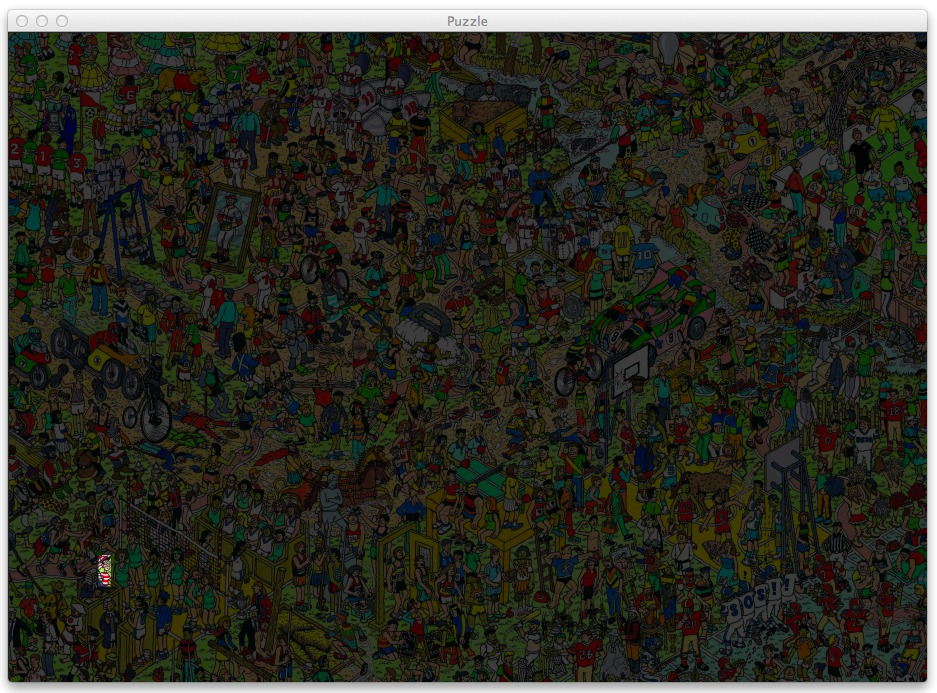
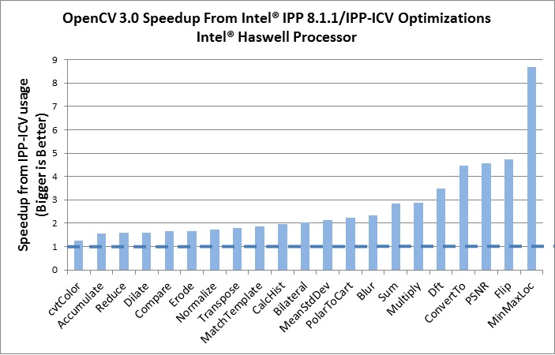

+++
title =  "Computer Vision Digest - August 2014"
date = "2014-08-30"
tags =  ["news", "digest"]
+++

Third [computer vision digest][digests]. Your monthly portion of news in computer vision for August 2014.

In this issue:
 - [Free Photo Editing Software Lets You Manipulate Objects in 3D](#1)
 - [Real-Time Digital Makeup with Projection Mapping](#2)
 - [Video stabilization through 3D scene recovery](#3)
 - [Using OpenCV, Python and Template Matching to play “Where’s Waldo?”](#4)
 - [OpenCV 3.0 alpha is out](#5)

Previous issues:
 - [Computer Vision Digest (May 2014)](/articles/2014-05-computer-vision-digest/)
 - [Computer Vision Digest (June 2014)](/articles/2014-06-computer-vision-digest/)

 

Feel free to leave your suggestions on interesting materials in post comments 
or via Twitter by mentioning [@cvtalks](https://twitter.com/cvtalks). 
Best links will be included into next digest!

## Free Photo Editing Software Lets You Manipulate Objects in 3D

How much Photoshop magic can you make with 2D photo? This software can do more! SIGGRAPH 2014 showed us a method that enables users to perform the full range of 3D manipulations, including scaling, rotation, translation, and nonrigid deformations, to an object in a photograph. Despite the fact it has limitations to use of stock 3D models set that are available for manipulation, it is great demonstration on how 2D and 3D can be combined together to bring image manipulation for the next level. I think Adobe is already buying these guys (and one girl).

The cool news, there are free demo, source code and publication paper that you can read:

 * [Source code](http://www.cs.cmu.edu/~om3d/sourcecodeversions.html)
 * [OS X (Mavericks) Executable Code and Examples](http://www.cs.cmu.edu/~om3d/agreement.html)
 * [Publication paper](http://www.cs.cmu.edu/~om3d/papers/SIGGRAPH2014.pdf)

## Real-Time Digital Makeup with Projection Mapping

This is how state of the art technologies comes to real life. Well studied algorithms and a bit of tech = amazing results. Projection mapping in conjunction with real-time face tracking made possible a virtual make-up! No more words. Watch this:  

<iframe src="//player.vimeo.com/video/103425574?byline=0&amp;portrait=0&amp;badge=0&amp;color=cfcaca" width="853" height="480" frameborder="0" webkitallowfullscreen mozallowfullscreen allowfullscreen></iframe> 

A true beauty of augmented reality. Girls, you don't need to do a make-up for virtual date anymore :) 

**So how did they made it?**

I assume this involves real-time frame tracker that outputs a face 3D model which is 99% tuned for particular person via offline training (Google: Active appearance model). 
Have you noticed white dots on her face? These are special markers that are used to "wire" face 3D model to real one. 

And then they take virtual makeup (A texture that mapped onto 3D face model) and deform it to match tracked model. A projector then maps virtual makeup onto actor. 

Well done, OMOTE. This was great demonstration!

Source: [Real-Time Digital Makeup with Projection Mapping](http://www.augmentedrealitytrends.com/augmented-reality/projection-mapping.html).

## Hyperlapse video stabilization through 3D scene recovery

This is not about Instagram :)

Microsoft Research showed more sophisticated video stabilization algorithms for making Hyperlapse video from the raw footage made with ordinary handheld camera. 

<iframe width="853" height="480" src="//www.youtube.com/embed/SOpwHaQnRSY?rel=0" frameborder="0" allowfullscreen></iframe>

Developers claim that their result impossible to achieve using alternative ways of stabilization. The method is based on the reconstruction of the 3D-scene, and then algorithm optimize "movement" of the camera along the route in order to avoid vibration, and combines the images pixel by pixel to smooth video sequence.

For example, the figure below shows this route (in black) and an optimized route, which is generated by the application to render the video (red).

The result is a so-called hyperlapse-video (named by analogy with the time-lapse, slow-motion filming).

<iframe width="853" height="480" src="//www.youtube.com/embed/sA4Za3Hv6ng?rel=0" frameborder="0" allowfullscreen></iframe>

Technicaly, the algorithm builds Hyperlapse video in three steps:
 1. **Recover 3D scene** from the camera motion. This is well-known task called "Structure from Motion" and one camera is enough to recover 3D environment (Google: Monocular SLAM). 
 2. **Optimize route** (or Path Planning) - on previous step algorithm recover camera route that include shakes, vibration and occasion motions that should be exludede from result Hyperlapse. The goal of this step is to make smooth and stable transition from frame to frame by optimizing route.
 3. ** Render Hyperlapse**. This step doing reverse things - it sample pixel values from all visible frames that were used to reconstruct given pose and pick best ones that produce really nice stiched image. Having 3D environment has a great advantage when algorithm has to "inpaint" missing reginos - it can sample pixels from the other frames because system reallly knows what is the 3D structure around.  

You can read publication of this approach from the Microsoft Research: [First-person Hyper-lapse Videos](http://research.microsoft.com/en-us/um/redmond/projects/hyperlapse/paper/hyperlapse.pdf).

## Using OpenCV, Python and Template Matching to play “Where’s Waldo?”

This [article][where-is-waldo] is for beginners who start learning computer vision. This tutorial describe very basic, but still powerful technique called template matching for object detection. “Where’s Waldo?” probably the best candidate for template matching demonstration - the task is very clear and this article contain step by step solution on detecting Waldo using computer vision. 

Using Python it's really simple to write your first algorithm:

    puzzle = cv2.imread(args["puzzle"])
    waldo = cv2.imread(args["waldo"])
    result = cv2.matchTemplate(puzzle, waldo, cv2.TM_CCOEFF)
    (_, _, minLoc, maxLoc) = cv2.minMaxLoc(result)
    # the puzzle image
    topLeft = maxLoc
    botRight = (topLeft[0] + waldoWidth, topLeft[1] + waldoHeight)
    roi = puzzle[topLeft[1]:botRight[1], topLeft[0]:botRight[0]]
 
    # construct a darkened transparent 'layer' to darken everything
    # in the puzzle except for waldo
    mask = np.zeros(puzzle.shape, dtype = "uint8")
    puzzle = cv2.addWeighted(puzzle, 0.25, mask, 0.75, 0)

    # put the original waldo back in the image so that he is
    # 'brighter' than the rest of the image
    puzzle[topLeft[1]:botRight[1], topLeft[0]:botRight[0]] = roi
     
    # display the images
    cv2.imshow("Puzzle", imutils.resize(puzzle, height = 650))
    cv2.imshow("Waldo", waldo)
    cv2.waitKey(0)

Original article can be found here: [Using OpenCV, Python and Template Matching to play “Where’s Waldo?”][where-is-waldo].

## OpenCV 3.0 alpha is out

That's it. OpenCV grows and going to college. 5 years has passed since OpenCV 2.0, which brought us a new C++ API, GPU-accelerated algorithms, iOS and Android platforms support, CUDA and OpenCL, Python and Java bindings. 

**Modular project architecture**. Since very beginning OpenCV was one solid project, built and shipped as a whole, and that was good strategy for many years. However, with constantly growing functionality, including bleeding-edge algorithms published a few minutes before a pull request has been submitted to our repository, and increasing number of contributors (thank you all very much, guys!) we came to the same conclusion and decision as many other big project – the solid model does not work anymore. 
 
**T-API**. GPU acceleration made really easy with brand new T-API (“transparent API”) made in cooperation with Intel and AMD. [T-API Samples](https://github.com/Itseez/opencv/tree/master/samples/tapi).

**OpenCV now linked with IPP by default**. Intel corporation gave OpenCV another exciting present. A subset of Intel Integrated Performance Primitives (IPP) is linked by default into OpenCV and is available at **no charge for all our users**. And that includes the license to redistribute applications that use IPP-accelerated OpenCV. As you may see, for quite a few image processing functions we achieved very noticeable speedup with IPP (where IPP is compared with OpenCV built with all possible optimizations turned on):

 

Last but not least, OpenCV 3.0 brings a lot of **new functionality**, such as:

 - Text detection and recognition by Lluis Gomez and Stefano Fabri
 - HDR by Fedor Morozov and Alexander Shishkov
 - KAZE/A-KAZE by Eugene Khvedchenya, the algorithm author Pablo Alcantarilla and some improvements by F. Morozov.
 - Smart segmentation and edge-aware filters by Vitaly Lyudvichenko, Yuri Gitman, Alexander Shishkov and Alexander Mordvintsev
 - Car detection using Waldboost, ACF by Vlad Shakhuro and Nikita Manovich
 - TLD tracker and several common-use optimization algorithms by Alex Leontiev
 - Matlab bindings by Hilton Bristow, with support from Mathworks.
 - Greatly extended Python bindings, including Python 3 support, and several OpenCV+Python tutorials by Alexander Mordvintsev, Abid Rahman and others.
 - 3D Visualization using VTK by Ozan Tonkal and Anatoly Baksheev.
 - RGBD module by Vincent Rabaud
 - Line Segment Detector by Daniel Angelov
 - Many useful Computational Photography algorithms by Siddharth Kherada
 - Shape descriptors, matching and morphing shapes (shape module) by Juan Manuel Perez Rua and Ilya Lysenkov
 - Long-term tracking + saliency-based improvements (tracking module) by Antonella Cascitelli and Francesco Puja
 - Another good pose estimation algorithm and the tutorial on pose estimation by Edgar Riba and Alexander Shishkov
 - Line descriptors and matchers by Biagio Montesano and Manuele Tamburanno
 - Myriads of improvements in various parts of the library by Steven Puttemans; thank you a lot, Steven!
 - Several NEON optimizations by Adrian Stratulat, Cody Rigney, Alexander Petrikov, Yury Gorbachev and others.
 - Fast foreach loop over cv::Mat by Kazuki Matsuda
 - Image alignment (ECC algorithm) by Georgios Evangelidis
 - GDAL image support by Marvin Smith
 - RGBD module by Vincent Rabaud
 - Fisheye camera model by Ilya Krylov
 - OSX framework build script by Eugene Khvedchenya
 - Multiple FLANN improvements by Pierre-Emmanuel Viel
 - Improved WinRT support by Gregory Morse
 - Latent SVM Cascade by Evgeniy Kozhinov and NNSU team (awaiting integration)
 - Logistic regression by Rahul Kavi
 - Five-point pose estimation algorithm by Bo Li

The 3.0-alpha package can be downloaded:
 - [Source code as .zip package directly from github](https://github.com/Itseez/opencv/tree/3.0.0-alpha)
 - [Precompiled, Windows](https://sourceforge.net/projects/opencvlibrary/files/opencv-win/3.0.0-alpha/)
 - [Precompiled, iOS](https://sourceforge.net/projects/opencvlibrary/files/opencv-ios/3.0.0-alpha/)

 [digests]: /tags/digest.html
 [where-is-waldo]: http://machinelearningmastery.com/using-opencv-python-and-template-matching-to-play-wheres-waldo/
 [video-stab]: http://habrahabr.ru/post/232877/
