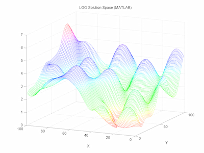

+++
title =  "Computer Vision Digest - September 2014"
date = "2014-10-01"
tags =  ["news", "digest"]
+++

Third [computer vision digest][digests]. Your monthly portion of news in computer vision for September 2014.

In this issue:
 - [Real-time face 3D model reconstruction](#1)
 - [Image color correction and contrast enhancement](#1)
 - [Robust Optimization Techniques in Computer Vision](#3)
 
Previous issues:
 - [Computer Vision Digest (May 2014)](/articles/2014-05-computer-vision-digest/)
 - [Computer Vision Digest (June 2014)](/articles/2014-06-computer-vision-digest/)
 - [Computer Vision Digest (August 2014)](/articles/computer-vision-digest-august-2014/)

 

Feel free to leave your suggestions on interesting materials in post comments 
or via Twitter by mentioning [@cvtalks](https://twitter.com/cvtalks). 
Best links will be included into next digest!

## Real-time face 3D model reconstruction

Researchers from the University of Washington prepared interesting presentation for the European Conference on Computer Vision (ECCV-2014). It is a real-time [3D face reconstruction from the video][face].

Using the video from YouTube, the program automatically builds highly detailed face 3D-model for each video frame. 

This is a very impressive result, given the complexity of the problem, because the facial expressions of the human face is very complex. For emotion recognition, it is important to see the exact position of the eyes, bending eyebrows, wrinkles. The smallest error in reconstructed 3D-model is highly noticeable.

<iframe width="800" height="600" src="//www.youtube.com/embed/C1iLVAUiC7s" frameborder="0" allowfullscreen></iframe>

The vast majority of other programs for face 3D-tracking uses blend shapes method, when the shape of the object changes, "flowing" from one state to another. The method of smooth deformations has lack of the small details that are so important for the perception of faces. The authors of the new algorithm abandoned this approach.

On the other hand, although the frame-independent reconstruction create a "separate" 3D mode from each frame, when you play on the 30/60 frames per second, the result should be more realistic than in the case of a smooth modification. 

And more. Unlike other technologies, it does not require human involvement in a test of a movie. Instead, a large archive of his photographs in different lighting conditions and poses, this method use video footrage that is tracked with optical flow (3D optical flow). Author research say that in our time for each person collected a large archive of photographs that can be used to reconstruct it's face.

Source: http://habrahabr.ru/post/237827/.

## Image color correction and contrast enhancement

A friend of mine shared a link to slideshare to the exhaustive research and analysis of color correction and contrast enchancement algorithms. How many of these have you worked with? I was impressed on how much algorithms has been developed so far. Just watch these slides, I bet - you'll find new algorithms you've never heard about. Cheers to Yu Huang for collecting them for us!

<iframe src="//www.slideshare.net/slideshow/embed_code/28271598?rel=0" width="597" height="486" frameborder="0" marginwidth="0" marginheight="0" scrolling="no" style="border:1px solid #CCC; border-width:1px; margin-bottom:5px; max-width: 100%;" allowfullscreen> </iframe> 
 <strong> <a href="https://www.slideshare.net/yuhuang/image-color-correction-contrast-adjustment" title="Image color correction and contrast enhancement" target="_blank">Image color correction and contrast enhancement</a> </strong> from <strong><a href="http://www.slideshare.net/yuhuang" target="_blank">Yu Huang</a></strong> 

## Robust Optimization Techniques in Computer Vision

    <strong>Math warning.</strong> Do not read this section unless you understand what damping function is and what is LevMar.

I've found nice slides from the ECCV 2014 workshop on non-linear optimization problems that happen in computer vision.

Course description
__________________

Many important problems in computer vision, such as structure from motion and image registration, involve model estimation in presence of a significant number of outliers. Due to the outliers, simple estimation techniques such as least squares perform very poorly. To deal with this issue, vision researchers have come up with a number of techniques that are robust to outliers, such as Hough transform and RANSAC (random sample consensus). These methods will be analyzed with respect to statistical modeling, worst-case and average exectution times and how to choose the balance between the number of outliers and the number of inliers. Apart from these classical techniques we will also describe recent advances in robust model estimation. This includes sampling based techniques with guaranteed optimality for low-dimensional problems and optimization of semi-robust norms for high-dimensional problems. We will see how to solve low-dimensional estimation problems with over 99% outliers in a few seconds, as well as how to detect outliers in structure from motion problems with thousands of variables.
Topics

 - [Session 1][s1]: Statistical models of robust regression. Introduction, motivations and applications. Relation to robust statistics. Occasional vs. frequent large-scale measurement noise (outliers). Low- vs. high-dimensional model estimation. Optimal vs. approximate methods. Multiple model fitting. Computational complexity.
 - [Session 2][s2]: Robust estimation with low-dimensional models. Hough transform. M-estimators. RANSAC and its variants. Branch and bound methods. Optimal methods. Fast approximate methods. Applications: Feature-based registration, multiple-view geometry, image-based localization.
 - [Session 3][s3]: Robust estimation with high-dimensional models. Robust norms and convex optimization. L_infinity-norm optimization with outliers. L_1-norm optimization on manifolds. Applications: Multiple-view geometry, large-scale structure-from-motion and subspace estimation.

You can read it here: http://www2.maths.lth.se/matematiklth/personal/fredrik/eccv2014_tutorial.html

 [digests]: /tags/digest.html
 [face]: http://grail.cs.washington.edu/projects/totalmoving/
 [s1]: http://www2.maths.lth.se/matematiklth/personal/fredrik/Session1.pdf
 [s2]: http://www2.maths.lth.se/matematiklth/personal/fredrik/Session2.pdf
 [s3]: http://www2.maths.lth.se/matematiklth/personal/fredrik/Session3.pdf
