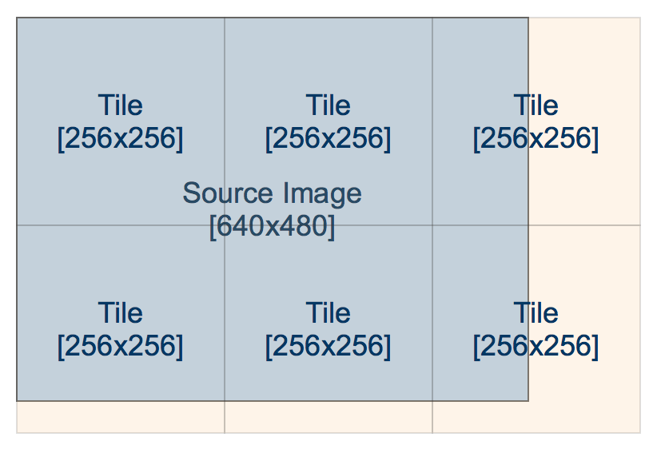
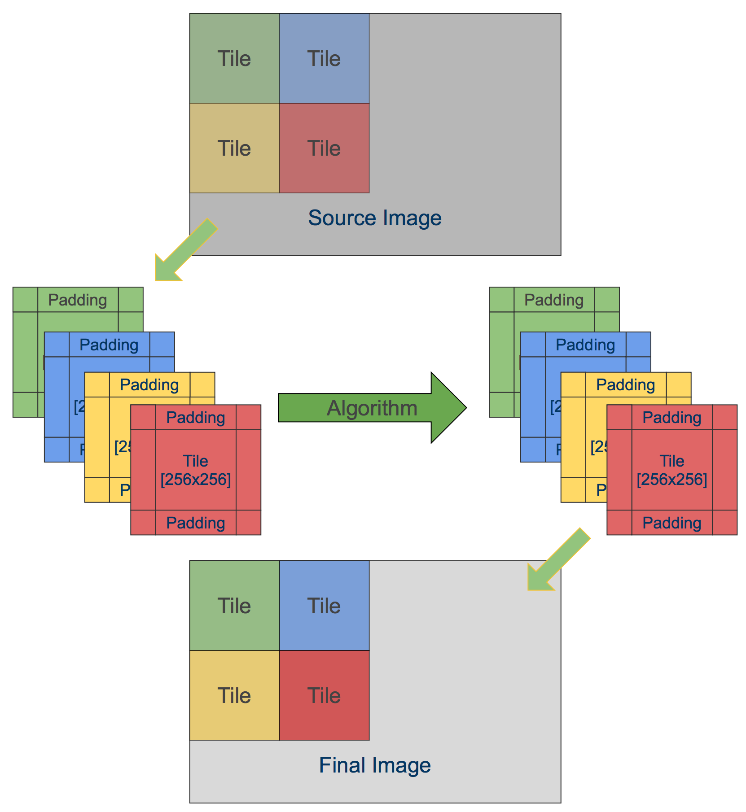
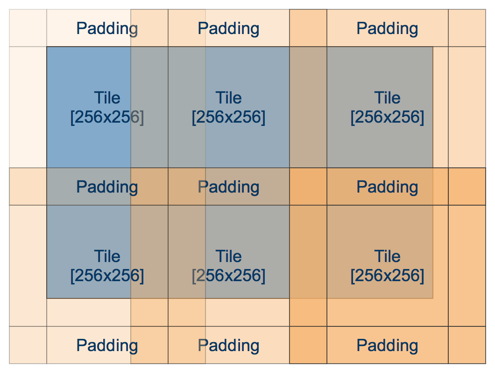

+++
title =  "Tile-based image processing"
date = "2014-12-04"
tags =  ["opencv", "tutorials", "algorithms"]
+++

How would you design an algorithm to process 40Mpx image? 100Mpx? What about gigapixel-sized panorams? Obviously, it should differs from those that are intended for 640x480 images. Here I want to present you implementation of the very simple but powerful approach called "Tile-based image processing". I will show you how to make this using OpenCV. 



<span class="more" />

First, let's define a few restrictions in order to simplify our implementation. In this tutorial I will consider a 'pass-through' pipeline - when we apply some function to input image and give an output image of the same size as an output. 

It is possible to extend this approach to work with many input images, but for the sake of simplicity I'll omit this for now.

Consider a following algorithm:

 1. Take a source image for RGB color space.
 2. Convert in to grayscale color space (unsigned byte).
 3. Compute Sobel derivatives (signed short).
 4. Take a Dx, Dy for each pixel and compute it's magnitude and orientation.
 5. Leave only those, which magnitude is larger than threshold.

Using OpenCV it could look like this:

```cpp
cv::Mat source = cv::imread("input.jpg");
cv::Mat grayscale, dx, dy;
cv::cvtColor(source, grayscale);
cv::Sobel(grayscale, dx, 1, 0);
cv::Sobel(grayscale, dy, 0, 1);
...
```

## Problems with straighforward implementation

This routine require ``N + 2 * N * sizeof(signed short)`` bytes of additional memory for straightforward implementation, where N is number of pixels in source image. Large number of intermediate buffers can cause memory issues for memory restricted devices (mobile phones, embedded systems). 

> On iOS, in particular, your app might get terminated by iOS watchdog for high peak RAM usage, despite the fact you use this memory only for a temp buffers. 

Second issue with large amount of buffers is cache-misses. Large buffers are likely to sit near each other, therefore cache performance will be low and algorithm performance will suffer.

To adress those two issues, I suggest to divide input image into "Tiles" - regions of the original image of equal size, let's say 64x64. The processing function remains the same, but we reuse all temporary buffers and process only 64x64 pixels at one time. 



Let's say we're processing ``1280x720`` frame, using regular approach, the total amount of 
additional memory is **4.6 megabytes** (``4608000`` bytes). With tile-based approach, we need only **20 kilobytes** (``20480`` bytes). 20K are likely to fit entirely in L2 cache and therefore give a significant performance boost.

## Tile-based implementation

To implement tile-based implementation, we iterate over the image, copy tiles from source image to our local source tile, process it and write to corresponding area in the 
destination image. 

A pseudo-code for this routine is follows:

```cpp
template<int TileSize, typename Algorithm>
void process(const cv::Mat& sourceImage, cv::Mat& resultImage, Algorithm algorithm) const
{
    assert(!resultImage.empty());
    assert(sourceImage.rows == resultImage.rows);
    assert(sourceImage.cols == resultImage.cols);

    const int rows = (sourceImage.rows / TileSize) + (sourceImage.rows % TileSize ? 1 : 0);
    const int cols = (sourceImage.cols / TileSize) + (sourceImage.cols % TileSize ? 1 : 0);

    cv::Mat tileInput, tileOutput;

    for (int rowTile = 0; rowTile < rows; rowTile++)
    {
        for (int colTile = 0; colTile < cols; colTile++)
        {
            copyTileFromSource(sourceImage, tileInput, rowTile, colTile);
            algorithm(tileInput, tileOutput);
            copyTileToResultImage(tileOutput, resultImage, rowTile, colTile);
        }
    }
}
```

I hope it's clear to understand what is happening in code above. The ``Algorithm`` here represents some algorithm that we want to run on our tiles. There are two functions ``copyTileFromSource`` and ``copyTileToResultImage`` that will be covered a bit later.

## Dealing with out-of-tile reads

You may ask yourself - what should we do with border pixels? Sobel operator use neighbor pixels around each pixel. When we construct a tile shouldn't we take this into account? Sure we are. So that's why there is a padding parameter that controls amount of additional pixels that are added to top, left, bottom and right of the tile in order to make functions that require additional pixels work correct.


Padding makes tile overlap each other, but we pay this price for good cache locality.

I will use a slightly modified version of code from above:

```cpp
struct TiledAlgorithm
{
    TiledAlgorithm(int tileSize, int padding, int borderType)
        : mTileSize(tileSize)
        , mPadding(padding)
        , mBorderType(borderType)
    {
    }

    void process(const cv::Mat& sourceImage, cv::Mat& resultImage) const
    {
        assert(!resultImage.empty());
        assert(sourceImage.rows == resultImage.rows);
        assert(sourceImage.cols == resultImage.cols);

        int rows = (sourceImage.rows / mTileSize) + (sourceImage.rows % mTileSize ? 1 : 0);
        int cols = (sourceImage.cols / mTileSize) + (sourceImage.cols % mTileSize ? 1 : 0);

        cv::Mat tileInput, tileOutput;

        for (int rowTile = 0; rowTile < rows; rowTile++)
        {
            for (int colTile = 0; colTile < cols; colTile++)
            {
                cv::Rect srcTile(colTile * mTileSize - mPadding, 
                                 rowTile * mTileSize - mPadding, 
                                 mTileSize + 2 * mPadding, 
                                 mTileSize + 2 * mPadding);

                cv::Rect dstTile(colTile * mTileSize,            
                                 rowTile * mTileSize, 
                                 mTileSize, 
                                 mTileSize);

                copySourceTile(sourceImage, tileInput, srcTile);
                processTileImpl(tileInput, tileOutput);
                copyTileToResultImage(tileOutput, resultImage, dstTile);
            }
        }
    }

protected:
    virtual void processTileImpl(const cv::Mat& srcTile, cv::Mat& dstTile) const = 0;
    
    void copySourceTile(const cv::Mat& src, cv::Mat& srcTile, cv::Rect &tile) const;
    void copyTileToResultImage(const cv::Mat& tileImage, cv::Mat& resultImage, cv::Rect resultRoi);

};
```



To fill a tile with source image we should check whether tile is close to image border. In this case OpenCV will come to help with cv::copyMakeBorder function that helps us to fill the missing pixels with given border fill method. If tile including paddings are entirely in the image boundary, it's enough to just copy image region to a tile:

```cpp
void copySourceTile(const cv::Mat& src, cv::Mat& srcTile, cv::Rect &tile)
{
    auto tl = tile.tl();
    auto br = tile.br();

    cv::Point tloffset, broffset;

    //Take care of border cases
    if (tile.x < 0)
    {
        tloffset.x = -tile.x;
        tile.x = 0;
    }

    if (tile.y < 0)
    {
        tloffset.y = -tile.y;
        tile.y = 0;
    }

    if (br.x >= src.cols)
    {
        broffset.x = br.x - src.cols + 1;
        tile.width -= broffset.x;
    }

    if (br.y >= src.rows)
    {
        broffset.y = br.y - src.rows + 1;
        tile.height -= broffset.y;
    }

    // If any of the tile sides exceed source image boundary we must use copyMakeBorder to make proper paddings for this side
    if (tloffset.x > 0 || tloffset.y > 0 || broffset.x > 0 || broffset.y > 0)
    {
        cv::Rect paddedTile(tile.tl(), tile.br());
        assert(paddedTile.x >= 0);
        assert(paddedTile.y >= 0);
        assert(paddedTile.br().x < src.cols);
        assert(paddedTile.br().y < src.rows);

        cv::copyMakeBorder(src(paddedTile), srcTile, tloffset.y, broffset.y, tloffset.x, broffset.x, mBorderType);
    }
    else
    {
        // Entire tile (with paddings lies inside image and it's safe to just take a region:
        src(tile).copyTo(srcTile);
    }
}
```

For non-zero padding case we add additional pixels to source tile, therefore it has effective width and height of ``TileSize + Padding + Padding``, but after processing we write only central segment of the tile of size ``TileSize x TileSize`` to destination image. In case of Sobel, we need a padding of ``1``, because Sobel uses 3x3 kernel by default.

```cpp
void copyTileToResultImage(const cv::Mat& tileImage, cv::Mat& resultImage, cv::Rect resultRoi)
{
    cv::Rect srcTile(mPadding, mPadding, mTileSize, mTileSize);

    auto br = resultRoi.br();

    if (br.x >= resultImage.cols)
    {
        resultRoi.width -= br.x - resultImage.cols;
        srcTile.width -= br.x - resultImage.cols;
    }

    if (br.y >= resultImage.rows)
    {
        resultRoi.height -= br.y - resultImage.rows;
        srcTile.height -= br.y - resultImage.rows;
    }

    cv::Mat tileView = tileImage(srcTile);
    cv::Mat dstView = resultImage(resultRoi);

    assert(tileView.rows == dstView.rows);
    assert(tileView.cols == dstView.cols);

    tileView.copyTo(dstView);
}
```

## Application

This approach can be used when you need to guarantee low-memory footprint of your algorithm or you want to use data locality without changing a lot in your code. In this
case I suggest to pre-allocate data buffers as a continuous block of memory:

```cpp
// Our algorithm need three intermediate buffers: a,b,c that
// we want to store close to each other
class MyAlgorithm : public TiledAlgorithm
{
public:
    MyAlgorithm(int tileSize, int padding)
    {
        int size = tileSize + padding * 2;

        // Allocate all buffer as continuous array
        mBuffer.create(size * 3, size, CV_8UC1);
            
        // Create views to sub-regions of mBuffer
        a = mBuffer.rowRange(0,      size);
        b = mBuffer.rowRange(size,   2*size);
        c = mBuffer.rowRange(2*size, 3*size);
    }

private:
    cv::Mat mBuffer;

    cv::Mat a, b c;
}
}
```

Did you know, that JPEG-2000 coded use tile-based encoding and it allows this codec to retrieve (decode) an arbitrary region of the image? Also, tiles are widely used in aerial photography to stich images.

I hope you find this post interesting. Pleas let me know on which topics you would like to see in my blog. Feel free to drop a ping on [@cvtalks](https://twitter.com/cvtalks) or leave a comment. Thanks! 
