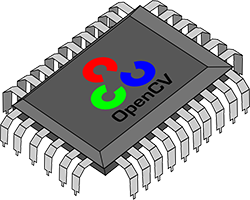

+++
title =  "Hacking OpenCV for fun and profit"
date = "2014-12-25"
tags = ["opencv"]
+++

<div class="featured-image">

</div>

This post convers very specific but important topic about writing memory-efficient code. 
I will show you how to collect and analyze memory allocations that happens in OpenCV.

When it comes to writing efficient code we usually care about CPU-efficiency. However there are
many times, when memory-efficiency is more important. A limited amount of RAM is not so rare as 
one can think. On iOS and Android there are a strict memory usage restrictions, and of your app
uses more memory than allowed your app can get killed by the system. Embedded hardware systems 
used in IoT, Raspberri Pi and others also have very limited amount of RAM. So you should be very
careful when porting code from desktop with gigabytes of memory to mobile platform.

<span class="more"></span>

## Why memory matters

Let's start with a small example of [unsharp masking](https://en.wikipedia.org/wiki/Unsharp_masking) to illustrate the problem:

```cpp
cv::Mat source, gray, grayFloat, blurred, unsharped;
source = cv::imread("/some/path/to/image.png");
cv::cvtColor(m, gray, cv::COLOR_BGR2GRAY)
gray.convertTo(grayFloat, CV_32F, 1.0 / 255.0);
cv::GaussianBlur(grayFloat, blurred, cv::Size(3,3));
unsharped = blurred * 1.5f - grayFloat * 0.5f;
```

How much additional memory required for this piece of code to work? Let's count:

```cpp
source = cv::imread("/some/path/to/image.png");         // N*M*3 bytes
cv::cvtColor(m, gray, cv::COLOR_BGR2GRAY)               // N*M bytes
gray.convertTo(grayFloat, CV_32F, 1.0 / 255.0);         // N*M*4
cv::GaussianBlur(grayFloat, blurred, cv::Size(3,3));    // N*M*4
unsharped = blurred * 1.5f - grayFloat * 0.5f;          // N*M*4   (in the best case)
                                                        // N*M*4*3 (in the worst case)
```

For NxM sized image we require at least sixteen (16!) times more memory in temporary variables.
Funny, but the code looks harmless for the first look. Now you can think what will happen if you
put this snippet into iOS application. Pictures made with iPhone 5S are about 3200x2400 pixels.
On such image this code will allocate 128Mb of memory!

I will leave it for you as a home-work to figure out a solution to minimize memory usage by this function.
In this post I want to demonstrate how to measure memory usage in OpenCV automatically. Complex projects are
harder to analyze like example above, so you definitely not going to re-calculate it after each change.

## Hacking OpenCV

Typically, when it comes to memory allocation tracing, we usually overload ``new operator`` to intercept all
allocations. In OpenCV it becomes even easier. There is a ``cv::fastMalloc`` function that is a memory allocator for
all OpenCV project. This means every ``cv::Mat`` allocation use it. So our goal is to change cv::fastMalloc to 'save'
allocations somewhere where we can access it in runtime.

To serve this purpose, I will write a helper class to store allocations/deallocations data. For analysys purposes,
it records peak memory usage, allocations count, current memory usage and number of live objects:

```cpp
// modules\core\include\opencv2\core.hpp
struct CV_EXPORTS MemorySnapshot
{
    //! Total amount of allocated memory.
    size_t allocatedMemory;

    //! Maximum amount of allocated memory for the whole time.
    size_t peakMemoryUsage;

    //! Maximum amount of allocated memory since last snapshot.
    size_t peakMemoryUsageSinceLastSnapshot;
    
    //! Number of memory allocations count for the whole program running time.
    size_t allocationsCount;

    //! Number of memory deallocations for the whole program running time.
    size_t deallocationsCount;
    
    //! Number of allocated objects that are still live (e.g not deallocated).
    size_t liveObjects;
};

CV_EXPORTS MemorySnapshot memorySnapshot();
```

An implementation of ``MemoryManager`` is very trivial and can be extended to collect statistics on individual allocations.
However for my needs this implementation was more than enough:

```cpp
// modules\core\alloc.cpp
class MemoryManager
{
public:
    //! Key - pointer to allocated memory, Value - it's size
    typedef std::map<void*, size_t>     AllocationTable;
    typedef std::lock_guard<std::mutex> LockType;

    void recordAlloc(void* ptr, size_t size)
    {
        LockType guard(mAllocMutex);
        mAllocatedMemory.insert(std::make_pair(ptr, size));

        mCurrentMemoryUsage += size;
        mPeakMemoryUsage = std::max(mPeakMemoryUsage, mCurrentMemoryUsage);
        mPeakMemoryUsageSinceLastSnapshot = std::max(mPeakMemoryUsageSinceLastSnapshot, mCurrentMemoryUsage);
        mAllocationsCount++;
    }

    void recordFree(void* ptr)
    {
        LockType guard(mAllocMutex);

        auto block = mAllocatedMemory.find(ptr);
        CV_Assert(block != mAllocatedMemory.end());
    
        mCurrentMemoryUsage -= block->second;
        mDeallocationsCount++;
        mAllocatedMemory.erase(block);
    }

   

    static MemoryManager& Instance()
    {
        std::call_once(mInitFlag, []() {
            if (mInstance == nullptr)
            {
                mInstance = new MemoryManager();
            }
        });

        return *mInstance;
    }

    MemorySnapshot makeSnapshot()
    {
        LockType guard(mAllocMutex);
        
        MemorySnapshot snapshot;
        snapshot.peakMemoryUsage = mPeakMemoryUsage;
        snapshot.peakMemoryUsageSinceLastSnapshot = mPeakMemoryUsageSinceLastSnapshot;
        snapshot.allocatedMemory = mCurrentMemoryUsage;
        snapshot.allocationsCount = mAllocationsCount;
        snapshot.deallocationsCount = mDeallocationsCount;
        snapshot.liveObjects = mAllocationsCount - mDeallocationsCount;
        
        mPeakMemoryUsageSinceLastSnapshot = 0;

        return std::move(snapshot);
    }
private:

    MemoryManager()
        : mCurrentMemoryUsage(0)
        , mPeakMemoryUsage(0)
        , mPeakMemoryUsageSinceLastSnapshot(0)
        , mAllocationsCount(0)
        , mDeallocationsCount(0)
    {
    }

private:
    std::mutex      mAllocMutex;
    AllocationTable mAllocatedMemory;

    size_t          mCurrentMemoryUsage;
    size_t          mPeakMemoryUsage;
    size_t          mPeakMemoryUsageSinceLastSnapshot;

    size_t          mAllocationsCount;
    size_t          mDeallocationsCount;

    static std::once_flag  mInitFlag;
    static MemoryManager * mInstance;
};
```

Now it's time to inject our MemoryManager into ``cv::fastAlloc`` / ``cv::fastFree`` functions and create new function ``cv::memorySnaphot`` to retrieve memory snapshots:

```cpp
// modules\core\alloc.cpp
void* fastMalloc( size_t size )
{
    uchar* udata = (uchar*)malloc(size + sizeof(void*) + CV_MALLOC_ALIGN);

    if(!udata)
        return OutOfMemoryError(size);

    MemoryManager::Instance().recordAlloc(udata, size);
    uchar** adata = alignPtr((uchar**)udata + 1, CV_MALLOC_ALIGN);
    adata[-1] = udata;
    return adata;
}

void fastFree(void* ptr)
{
    if(ptr)
    {
        uchar* udata = ((uchar**)ptr)[-1];
        CV_DbgAssert(udata < (uchar*)ptr &&
               ((uchar*)ptr - udata) <= (ptrdiff_t)(sizeof(void*)+CV_MALLOC_ALIGN));

        MemoryManager::Instance().recordFree(udata);
        free(udata);
    }
}

MemorySnapshot memorySnapshot()
{
    return std::move(MemoryManager::Instance().makeSnapshot());
}
```

That's all with hacking OpenCV. One last step is to rebuild OpenCV with any C++11 conformant compiler and we can use memory manager for analyzing our code.

## Fun & Profit

Back to first example, we want to measure memory usage after each step. Here's how C++ macros can help us:

```cpp
cv::Mat source, gray, grayFloat, blurred, unsharped;
MEASURE_MEMORY(m = cv::imread("/some/path/to/image.png"));
MEASURE_MEMORY(cv::cvtColor(m, gray, cv::COLOR_BGR2GRAY));
MEASURE_MEMORY(gray.convertTo(grayFloat, CV_32F, 1.0 / 255.0));
MEASURE_MEMORY(cv::GaussianBlur(grayFloat, blurred, cv::Size(5, 5), 5));
MEASURE_MEMORY(unsharped = blurred * 1.5f - grayFloat * 0.5f);
```

Where ``MEASURE_MEMORY`` is a helper macro defined as follows:

```cpp
#define MEASURE_MEMORY(x) { size_t memOnStart = cv::memorySnapshot().allocatedMemory; x; \
                            size_t memOnEnd = cv::memorySnapshot().allocatedMemory;      \
                            std::cout << #x << "\t" << memOnStart << "/" << memOnEnd << std::endl; }
```

Example output is the following (The image was 3200x2400):

```cpp
m = cv::imread("/some/path/to/image.png")               //      743/ 23971559 +23Mb
cv::cvtColor(m, gray, cv::COLOR_BGR2GRAY)               // 23971559/ 31961831 +7.6Mb
gray.convertTo(grayFloat, CV_32F, 1.0 / 255.0)          // 31961831/ 63922919 +30Mb
cv::GaussianBlur(grayFloat, blurred, cv::Size(5, 5), 5) // 63922919/ 95884007 +30Mb
unsharped = blurred * 1.5f - grayFloat * 0.5f           // 95884007/127845095 +30Mb
```

As you can see, numbers are really close to predicted. This way you can measure memory usage, peak usage,
number of allocations in your program easily, spot memory-related issues and fix them before they appear on
customer's hardware.

## Source code

The modified OpenCV source code can be found here: [https://github.com/BloodAxe/opencv/tree/memory-snapshots](https://github.com/BloodAxe/opencv/tree/memory-snapshots). Don't forget to enable it by building OpenCV with ENABLE_MEMORY_SNAPSHOTS=YES option.

I have sent pull-request to OpenCV team, so there is a chance it will be included into official OpenCV. Let's keep fingers crossed.

## License

The code is available for use any commercial and non-commercial purposes, but please keep a credit by providing a 
link to my website [computer-vision-talks.com](http://computer-vision-talks.com) and email [ekhvedchenya@gmail.com](ekhvedchenya@gmail.com).