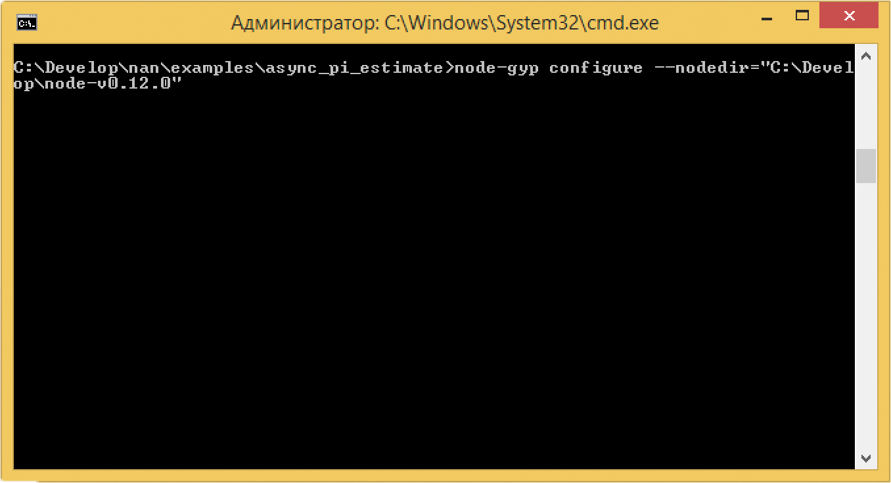
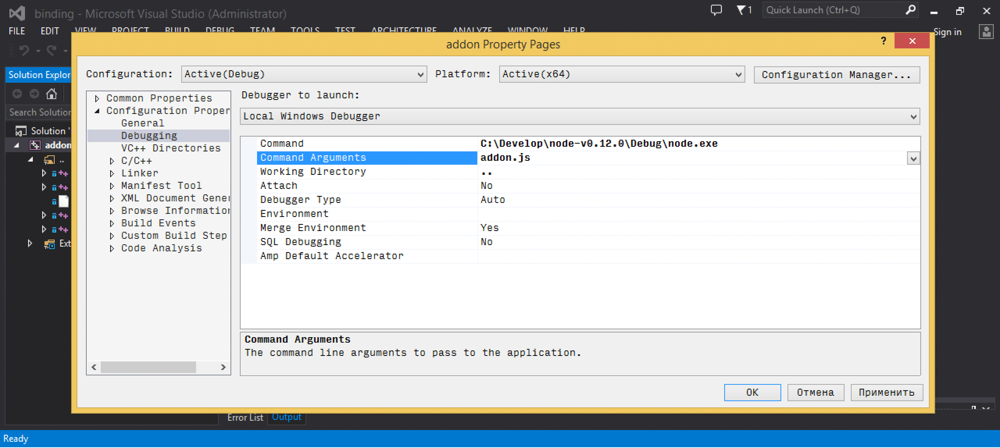

+++
title =  "How to debug node.js addons in Visual Studio"
date = "2015-03-17"
tags =  ["tutorials", "nodejs", "visualstudio"]
+++

While working on [CloudCV][cloudcv] I encountered problems in node.js addon written in native code. For CloudCV I use node.js with C++ Addon to separate high-performance algorithms (C++) from high-level networking API which node provides.

In this tutorial I'm going to reveal best practices on debugging C++ Addons for Node.js (0.12) using Visual Studio 2013.

<div class="embed-responsive embed-responsive-4by3">
  <iframe class="embed-responsive-item" src="https://www.youtube.com/embed/eqhv42jVN6s" allowfullscreen></iframe>
</div>

Continue reading if you want to read in details why this works.

<span class="more" />

This article is valid for Node.js version 0.12. It should also works fine for further releases, however few things may change. I will try to keep this post up to date. Please, feel free to drop a comment for this article or write me on [@cvtalks][twitter] if you have troubles following this tutorial.

## Before we start

You will need a Visual Studio 2013 ([Express edition][vsexpress] should be enough). Also, please come and grab [Node.js source][nodejssources]] code. We will use it later to build Debug configuration of Node.js. I assume you 
already have production (Release) version of Node and NPM as we will need [node-gyp][node-gyp] to generate and build C++ Addon project. So please ensure you've installed them before going to next step:

```bash
npm install -g node-gyp
npm install -g nan
```


## Build Debug configuration of node.js

This is very straighforward step. 

1. Download [Node.js source][nodejssources]] code.
2. Extract it somewhere to your filesystem. For demonstration, I assume it will be in ``c:\Develop\node-v0.12.0``
3. Navigate to ``c:\Develop\node-v0.12.0`` and run ``vcbuild.bat debug nosign x64``. This batch script will build Debug configuration of node.js for 64-bit architecture (if you're on 32-bit platform omit this flag). A ``nosign`` flag tells to skip executable signing which is ok since we're not going to distribute it, and finally ``debug`` forces compiler to generate debug symbols for node executable.


If everything goes fine, you should see the following output:

```bash
c:\Develop\node-v0.12.0>vcbuild.bat debug nosign x64
ctrpp not found in WinSDK path--using pre-gen files from tools/msvs/genfiles.
creating  icu_config.gypi

...

creating  config.gypi
creating  config.mk
Project files generated.

...

debugger-agent.vcxproj -> c:\Develop\node-v0.12.0\Debug\lib\debugger-agent.lib
v8_nosnapshot.vcxproj -> ..\..\..\..\build\Debug\lib\v8_nosnapshot.lib
openssl-cli.vcxproj -> c:\Develop\node-v0.12.0\Debug\\openssl-cli.exe
mksnapshot.vcxproj -> ..\..\..\..\build\Debug\\mksnapshot.exe
v8_snapshot.vcxproj -> ..\..\..\..\build\Debug\lib\v8_snapshot.lib
node.vcxproj -> c:\Develop\node-v0.12.0\Debug\\node.exe
```


If you have problems on this step, please refer to [building node.js][building-node] official documentation.

## Building Debug configuration of C++ Addon

A C++ Addon for nodejs is nothing but ordinary DLL. Therefore Visual Studio can load it and let you do step-by-step debugging inside node.js app.
Let's start with simple scenario. I will use [Pi estimation][piest] example from [NaN][nan] project.

Your C++ Addon code can look as follows:

```cpp
/*********************************************************************
 * NAN - Native Abstractions for Node.js
 *
 * Copyright (c) 2015 NAN contributors
 *
 * MIT License <https://github.com/rvagg/nan/blob/master/LICENSE.md>
 ********************************************************************/

var addon = require('./build/Release/addon');
var calculations = process.argv[2] || 100000000;

function printResult(type, pi, ms) {
  console.log(type, 'method:')
  console.log('\tπ ≈ ' + pi
        + ' (' + Math.abs(pi - Math.PI) + ' away from actual)')
    console.log('\tTook ' + ms + 'ms');
    console.log()
}

function runSync () {
  var start = Date.now();
  // Estimate() will execute in the current thread,
  // the next line won't return until it is finished
    var result = addon.calculateSync(calculations);
  printResult('Sync', result, Date.now() - start)
}

function runAsync () {
  // how many batches should we split the work in to?
    var batches = process.argv[3] || 16;
    var ended = 0;
    var total = 0;
    var start = Date.now();

    function done (err, result) {
        total += result;

    // have all the batches finished executing?
        if (++ended == batches) {
            printResult('Async', total / batches, Date.now() - start)
        }
    }

  // for each batch of work, request an async Estimate() for
  // a portion of the total number of calculations
    for (var i = 0; i < batches; i++) {
        addon.calculateAsync(calculations / batches, done);
    }
}

runSync()
runAsync()
```

And you also should have gyp file which tells node-gyp how to build your addon:

```gyp
{
  "targets": [
    {
      "target_name": "addon",
      "sources": [
        "addon.cc",
        "pi_est.cc",
        "sync.cc",
        "async.cc"
      ],
      "include_dirs": ["<!(node -e \"require('nan')\")"]
    }
  ]
}
```

Assuming you're in root C++ addon directory, you can now generate a solution for Visual Studio to build your addon:

```bash
node-gyp configure rebuild --nodedir="c:\Develop\node-v0.12.0"
```



What is really important here, is ``--nodedir="c:\Develop\node-v0.12.0"`` flag, which indicates to link against node in specified 
folder rather than system wide available.

<p class="bg-info lead">
This is very important to match Debug node with Debug C++ Addon, otherwise you will have 
linker issues caused by inconsistent CRT's.
</p>

After node-gyp finishes, a .node file (this is .dll, don't be misleaded by .node extension) will be generated in /build/Debug/ folder.


Now it's time to write a small node.js script that utilizes our addon:

```nodejs
var addon = require('./build/Release/addon');

function printResult(type, pi, ms) {
  console.log(type, 'method:')
  console.log('\tπ ≈ ' + pi
        + ' (' + Math.abs(pi - Math.PI) + ' away from actual)')
    console.log('\tTook ' + ms + 'ms');
    console.log()
}

function runAsync () {

    var start = Date.now();

    function done (err, result) {
        console.log('\tπ ≈ ' + pi + ' (' + Math.abs(pi - Math.PI) + ' away from actual)')
        console.log('\tTook ' + ms + 'ms');
        console.log()

        printResult('Async', total / batches, Date.now() - start)
    }

    addon.calculateAsync(1024, done);
}

runAsync()
```

You may wonder now, how to debug it. Patience, we're almost there. 


1. Navigate to ``build/`` directory of your C++ Addon and 
open solution file. 
2. Ensure that you have active Debug configuration. 
3. Navigate to project properties and open Debugging tab there.
4. Modify command name to "c:\Develop\node-v0.12.0\Node.exe" (Change this path if you extracted node somewhere else)
5. Set a command argument to full name of your node.js script.
6. Change working directory to a place where your script is. This step important when you have complex nodej.js application with 
dependencies.
7. Set breakpoint somewhere in your C++ Addon code.
7. Now hit 'Debug' (F5) and enjoy!



## How it works

When building Debug builds, Visual Studio trades speed for easy debugging. This means not only slower code, but it also preserves debug
symbols (a table of function addresses/names/file locations). When you start a debugger on process, VS attachs to it and tries to load 
symbols for this binary and all dynamically loaded libraries it uses. 


As a consequence, debug symbols for C++ addon is being loaded which allows you to see program execution location in your IDE, 
do step-by-step debugging and change/rebuild/debug as usual.

## Conclusion

I hope you find this post useful. From my experience debugging node.js <-> C++ interop can be nasty. Personally I follow this 
scenario for debugging CloudCV C++ backend. This saves a lot of time and nerves. Unleash your node.js with C++ and happy debugging!

[twitter]: https://twitter.com/cvtalks
[cloudcv]: https://cloudcv.io
[vsexpress]: http://go.microsoft.com/?linkid=9832256
[nodejssources]: http://nodejs.org/dist/v0.12.0/node-v0.12.0.tar.gz
[node-gyp]: https://github.com/TooTallNate/node-gyp
[building-node]: https://github.com/joyent/node/wiki/installation#building-on-windows
[nan]: https://github.com/rvagg/nan
[piest]: https://github.com/rvagg/nan/tree/master/examples/async_pi_estimate