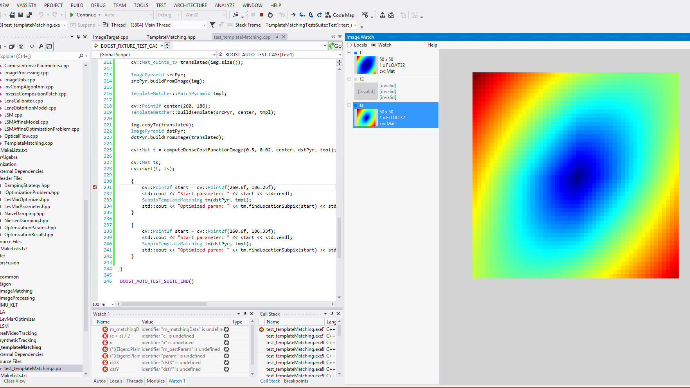

+++
title = "How to write a good code"
date = "2015-09-09"
tags =  ["news", "digest", "cpp"]
thumbnail = "post/2015-09-how-to-write-good-code/featured-image.jpg"
+++

This article is a quintessence of my all experience 
I've got for years working as a computer vision consultant. 
I hope you will find this interesting and useful. 
My goal was to create set of rules I follow personally on daily basis. 

<!--more-->

# 1. Prefer functional approach


Image processing is a place where functional paradigm shows it's bests. 
In most cases, image processing algorithm depends only on input image and has no side effects. 
This fits perfectly to a 'pure function' term. When possible try to follow this checklist when you define a function in your code:

- Mark all input data with ``const`` modifier to specify immutable arguments.
- Prefer return by reference for large objects (especially for images) instead returning by value.
- In case of class methods, mark methods that does not change class internal state with  ``const `` modifier.

These simple advice helps to understand what and when can you function change. You may remember tricky details of your code today, but who guarantees you'll easily remember that in a month?

For instance, I want to write implementation of template matching. One may write it as follows:

```cpp
class TemplateMatchingAlgorithm
{
public:
  TemplateMatchingAlgorithm(cv::Mat templateImage, int method);

  cv::Point matchTemplate(cv::Mat queryImage) const;

private:
  cv::Mat _templateImage;
  int   _method;
};
```

Compare it with function declaration that does the same job, but looks much cleaner:

```cpp
void MatchTemplate(cv::Mat templateImage, cv::Mat queryImage, cv::Point& minPoint, int method);
```

So you may ask, should I create class with const method or declare an ordinary function instead?
The short answer - functions are better. I personally use simple decision algorithm: 

<div class="alert alert-info" role="alert">
  If the algorithm needs to preserve state between calls - use class; otherwise - use function.
</div>

## 2. Don't use virtual methods


You may argue - with classes we can define various implementations for ``TemplateMatching`` using SIDM, CUDA or use template matching in Fourier domain. 
Yes, we can. But the price we pay for each call of virtual method is too big for such small routine as template matching.
Usually we use TemplateMatching on small patches like 11x11 pixels to track translation between two frames of video. Hence to achieve robust tracking, number of patches can be quite high - 500 and even 1000 per one frame. Further, coarse-to-fine matching and sub-pixel optimization can lead to ten or more calls for the same feature. In this case, virtual call is a big no-no that will kill your application's performance.

<div class="alert alert-info" role="alert">
As a rule of thumb: you *may* use virtual methods to execute big amount of work. Let's say one virtual call per frame looks totally fine. A thousand calls per frame is obviously a bad, bad idea.
</div>


## 3. Write regression tests


Regression testing is a great tool to track all changes in your algorithm and measure it's 
precision and performance. Here's an idea: 

- Create a ground-truth input dataset
- Process it with your algorithm.
- Save output data and track it in your version control system.  
- Each time you make changes in implementation - run regression on same input data and compare results.

Regression testing can easily spot numeric stability problems on different compilers / platforms, introduced bugs, platform-dependent optimizations. It's a good idea to include it as a part of regular unit testing:

```cpp
/*
BOOST_AUTO_TEST_CASE(MyAlgorithm, createRegressionDatabaset)
{
    ...
}
/**/

BOOST_AUTO_TEST_CASE(MyAlgorithm, checkRegression)
{
    ...
}
```

I intentionally commented out first test case - in ideal world it should be executed only once. 
But sometimes it's necessary to update ground-truth (you fixed a bug in original implementation).
So you uncomment it, run tests, comment it back and check-in new ground-truth.

You may use any format you like for dumping ground truth data (usually it's some matrices, vectors or images). 
Personally, I prefer YAML and JSON. 
Just ensure when dumping floating-point numbers to specify maximum output precision. 
Otherwise you will have funny weekend debugging absolutely correct algorithm with failing assertion check ``
0.1543642342365 != 0.154364``.

<div class="alert alert-info" role="alert">
Once written, regression tests should be run on regular basis either manually or using automated CI system of your choice. 
</div>

## 4. Add logging to your code


In the simplest case, it could be trivial console logging. 
In debug mode you will have all messages in stdout, but in release it will be totally excluded from compilation step. 

```cpp
#if _DEBUG
#define LOG_MESSAGE(x) std::cout << __FILE__ << " (" << __LINE__ << "): " << x << std::endl;
#else
#define LOG_MESSAGE(x)
#endif
```

For complex systems I suggest to use mature logging frameworks like Boost::Log or similar. 
They has separation of logging streams (info, trace, warning, errors) and deal with multi-threaded logging.
Logging to file is also useful feature when you want to store program output for further analysis.

In one of my previous projects, there was a standalone program for logs analysis and data visualization. We logged
all - matrices, vectors regular messages with timestamps. After program finishes we were able to trace program flow 
frame by frame and analyze how our algorithms behaved. I cannot count how much hours this tool saved to us on data analysis.

Logging also helps to spot nasty bugs when you have inconsistent behavior on different platforms. For instance, not so recently I faced a problem when optical flow tracker gave different results on iOS and OSX platforms. After logging all input/output and intermediate data including vectors, matrices I found the root of the evil. It was ``std::log`` function.

<div class="alert alert-warning" role="alert">
On OSX ``std::log(float)`` implicitly computes logarithm with double precision and returns truncated result (float). On iOS it computes logarithm using single precision leading to small difference in result. Like a butterfly effect, it affects all other parts of the algorithm. 
<br>
**Without logging it would be practically impossible to spot bug like this**.
</div>


## 5. Profile your code


Algorithm performance usually a top-level priority since this kind of applications deal with real-time video processing and processing of huge amount of data. 
Therefore it's crucial to know how fast your algorithms runs or do they become slower or faster with refactoring you perform. 
There are plenty of ways to collect this data. 

### XCode Instruments

If you're targeting on OSX and iOS platform, Apple Xcode and Instruments can be your first choice due to natural integration of profiling tools to IDE. 
Instruments can be handy to spot problematic places in your code. But Instruments uses sampling technique, which is not precise. 

### VTune/VisualStudio

For Windows users Visual Studio offers integrated profiler as well. 
Unlike Instruments, it can do instrumentation of your binary. 
It means each function in your program modified with special prolog and epilog code that measure execution time of all your program. 
Instrumenting provides you a lot of information per each routine: calls count, execution time, inclusive / exclusive CPU time, call tread and CPU cores load. 
This is much more you have with Apple Instruments.

### cv::getTickCount

Sometimes you don't want to profile entire application. Instead you want to 'cherry-pick' only a single function and profile it. For this purpose you can use monotonic clock and measure execution time:

```cpp
#define MEASURE_TIME(x)                        \
        { auto startTime = cv::getTickCount(); \ 
          x;                                   \
          auto endTime = cv::getTickCount();   \
          std::cout << #x << " " << (endTime - startTime) * cv::getTickFrequency() << std::endl; }

// Measure MatchTemplate
MEASURE_TIME(MatchTemplate(a,b,result));
```

<div class="alert alert-info" role="alert">
  Profile your code. Always.
</div>


## 6. Optimize code

### 6.1 Loop vectorization

Compilers can do loops vectorization when data flow and iterations count are clear enough. 
This heuristic analysis depends on implementation, so CLang has different vectorization analysis engine than MSVC. But you can give your compiler a hint:

```cpp
void SSD(cv::Mat i1, cv::Mat i2)
{
  int i = 0;
  const uint8_t * a = templateImage.data;
  const uint8_t * b = templateImage.data;
  
  int ssd = 0;

  for (; i < (length/4)*4; i+=4)
  {
    ssd += SQR(a[i+0] - b[i+0]);
    ssd += SQR(a[i+1] - b[i+1]);
    ssd += SQR(a[i+2] - b[i+2]);
    ssd += SQR(a[i+3] - b[i+3]);
  }

  for (; i < length; i++, a++, b++)
  {
    ssd += SQR(a[i] - b[i]);
  }

  return ssd;
}
```

This partial loop unrolling gives enough information to compiler. 
As a result it can replace partially unrolled summation with SIMD instruction.

### 6.2 Bring constants at compile time

If you have a priory knowledge on size of data you pass to particular function, it may make sense to write function that
employs this information:

```cpp
template <typename TOut, typename TIn, int RowsAtCompileTime, int ColsAtCompileTime>
inline TOut SSD(const cv::Matx_<TIn, RowsAtCompileTime, ColsAtCompileTime>& a, 
                const cv::Matx_<TIn, RowsAtCompileTime, ColsAtCompileTime>& b) nothrow
{
  int i = 0;
  const TIn * a = templateImage.data;
  const TIn * b = templateImage.data;
  
  TOut ssd = 0;

  for (int i = 0; i < RowsAtCompileTime * ColsAtCompileTime; i++, a++, b++)
  {
    ssd += (TOut)SQR(a[i] - b[i]);
  }

  return ssd;
}
```

Since compiler knows size of the array to process, it can easily generate vectorized code for this routine. 
The drawback of this approach is slightly increased code size if you instantiate this template function with many sizes. 
But you get better performance which usually worth it. 

### 6.3 Architecture-dependent implementations

Architecture-specific features like SIMD instructions can make your code runs much, much faster than generic C++
implementation. 
It is a must-have feature on mobile platforms since it makes your code faster and at the same time it 
conservate battery power of host device. 
There are more and more devices with CUDA and OpenCL support. 
And the question is - how do I manage all those possible architecture / platforms combinations of optimized functions in my code?

Here it's how I solved this task for myself:
```cpp
namespace mypublicnamespace
{
    void MatchTemplate(cv::Mat templateImage, cv::Mat queryImage, cv::Point& minPoint, int method)
    {
#if TARGET_PLATFORM_HAS_NEON_SIMD
        details::neon::MatchTemplate(templateImage, queryImage, minPoint, method);
#elif TARGET_PLATFORM_HAS_SSE_SIMD
        details::sse::MatchTemplate(templateImage, queryImage, minPoint, method);
#elif TARGET_PLATFORM_HAS_OPENCL
        details::opencl::MatchTemplate(templateImage, queryImage, minPoint, method);
#else        
        details::generic::MatchTemplate(templateImage, queryImage, minPoint, method);
#endif    
    }
}
```

This code snippet demonstrate compile-time dispatching for particular implementation of a function declared in ``mypublicnamespace``. Of course, you should take care of preprocessor defines that declare platform / architecture capabilities. I 

### 6.4 Branch prediction

Suppose you have a-priory knowledge that condition expression will be almost always true. 
Why don't give this intrinsic knowledge to compiler? By supplying *expected* condition result compiler can
generate more efficient code. As a result, CPU will start decoding instructions earlier.

Unfortunately, this feature supported only on GCC and CLANG.
But according to measurements, it can provide significant speed-up up to ~15%. You can find more information here: [How much do __builtin_expect(), likely(), and unlikely() improve performance?](http://blog.man7.org/2012/10/how-much-do-builtinexpect-likely-and.html).

```cpp
#define LIKELY(x)      __builtin_expect(!!(x), 1)
#define UNLIKELY(x)    __builtin_expect(!!(x), 0)

if (LIKELY(x >= 0 && x <= image_width))
{
  // Compute something
}

if (UNLIKELY(std::fabs(value) <= std::numeric_limits<float>::epsilon()))
{
  throw std::runtime_error("Value is zero");
}
```

### 6.5 OpenMP

Starting from OpenMP 4.0, you can instruct compiler to generate vectorized code by adding new pragma instructions to your loops:

```cpp
void MatchTemplate(cv::Mat templateImage, cv::Mat queryImage, cv::Point& minPoint, int method)
{
  uint8_t * a = templateImage.data;
  uint8_t * b = templateImage.data;
  
  int ssd = 0;

#pragma omp simd reduction(+:x)
  for (int i = 0; i < length; i++)
  {
    ssd += SQR(a[0] - b[0]);
  }
}
```

With only single ``#pragma`` instruction you made your code runs faster. 
I encourage you to visit [Enabling SIMD in program using OpenMP4.0](https://software.intel.com/en-us/articles/enabling-simd-in-program-using-openmp40) webpage for more information of supported OpenMP SIMD instructions.


### 7. Use ImageView

For Windows users there is a great Visual Studio plugin called [ImageWatch](https://visualstudiogallery.msdn.microsoft.com/e682d542-7ef3-402c-b857-bbfba714f78d) that makes our life so simple.
This plugin can visualize OpenCV matrices right in IDE. 
It is hard to overestimate the usefulness of this plugin.
You can see how images are changing while debugging. 

  


# Conclusion

Next time when you start development of new algorithm, keep in mind these simple steps. 
They will help you create fast, maintainable and clear code. Here they are:

1. Prefer functional approach
2. Try avoid virtual calls
3. Write vectorization-friendly code
4. Use all available debugging / profiling tools
5. Measure your code performance
6. Write tests and check regression

Hope you found this post useful. Discussion is more than welcome. Please share your thoughts in comments. 