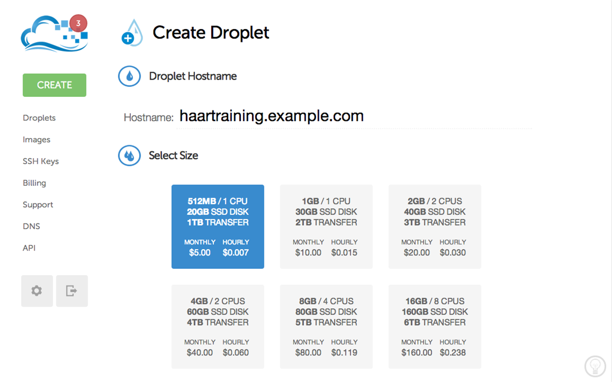
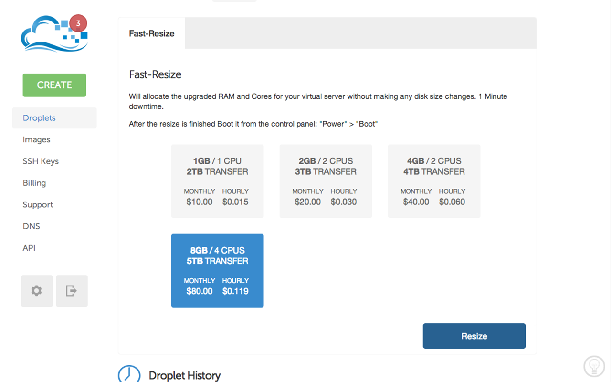
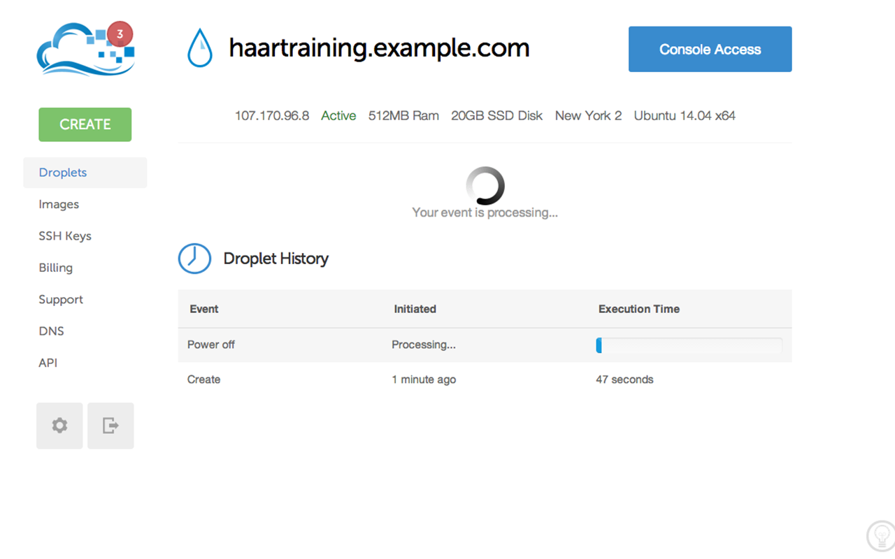
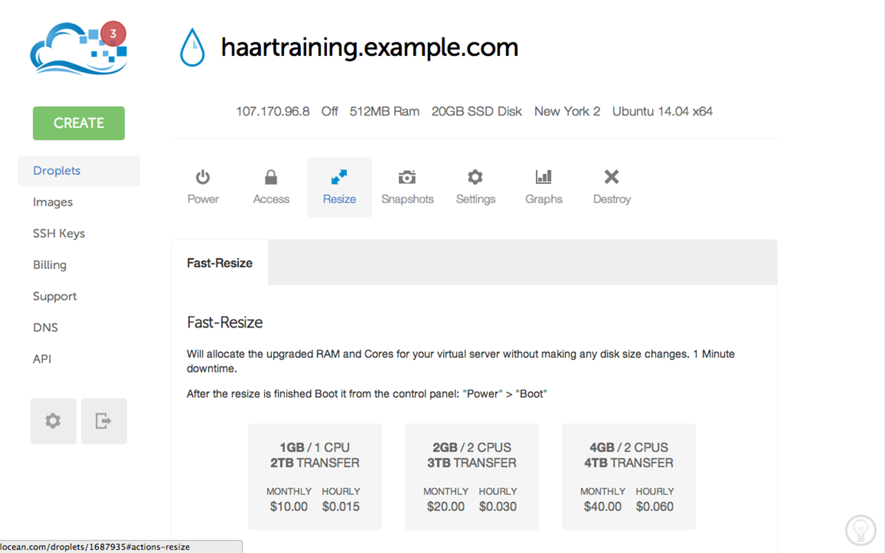

+++
title =  "Training Haar cascade in the cloud"
date = "2014-05-20"
tags =  ["opencv", "cloud-computing", "tutorials"]
+++

In this post I'll show you how you can train cascade classifier with OpenCV very quickly even if you have low-end hardware using virtual machine in the cloud.

<!--more-->

## Why Clouds?

Well, training a descriptor takes a lot of time. Depending on template size, number of samples and stages, it can take from several ours to a couple of days to train such cascade! Be prepared that during training stage your PC will likely be unusuable due to high RAM usage and CPU load. If you're on laptop - it will become hot really quick. So, what if you have to train your cascade, but you don't have either time or spare machine to do this? 

Recently I've faced this problem in one of my personal projects. What even more funny, a 10 hours flight was approaching, but I didn't wanted to waste this time for nothing. I only had a laptop, but this task will drain my battery for sure. So I've decided to use virtual server to do this. 

## Step 1 - Environment setup

First, I've created a basic droplet in [DigitalOcean][digitalocean]. 
Yep, for 5$/month you can have your droplet that can do much! 
It takes only 55 seconds to deploy a new instance (I assume you're familiar with SSH keys, terminal, Git and so on.) and we're ready to rock!



## Step 2 - Install latest OpenCV release

There are two ways to do this: either using package managers (homebrew, yum or apt-get) or builiding it from scratch.
Personally I prefer second option since you can configure OpenCV. Usually I build static libs whith apps but without tests, java, cuda, python, OpenEXR, Jasper and Tiff. Regardless of the way you choose to install OpenCV, ensure that opencv apps (opencv_createsamples, opencv_traincascade) are also installed!.

## Step 3 - Prepare your train data

There are a lot of tutorials [1][tut1], [2][tut2], [3][tut3] on how to train cascade with OpenCV: which images are good for positive and negative samples and which settings should be used for cascade training. Let's assume you have everything in a single folder on your load machine and there is a script called "train.sh" that starts training stage:

```bash
opencv_traincascade -data classifier \
                    -vec <positive samples file> \
                    -bg <negative samples file> \
                    -numStages 12 \
                    -minHitRate 0.999 \
                    -maxFalseAlarmRate 0.5 \
                    -numPos 15000 -numNeg 17000 \
                    -w 24 \
                    -h 24 \
                    -mode ALL \
                    -nonsym 1 \
                    -featureType LBP
```

## Step 4 - Deploy train data to cloud

The easiest way to upload this folder to your virtual droplet is to use the [rsync][rsync] tool.

```bash
rsync -avz <source> <destination>
```

For instance, the following command will upload the traindata/ folder with it's content to ~haartraining.example.com~ webserver to /traindata directory. This example assumes that your public key has been added to haartraining.example.com during droplet creation.

```bash
rsync -avz ~/Develop/traindata root@haartraining.example.com:/traindata
```

## Step 5 - Start training

The easiest way to execute training is to login to remote maching using ssh and execute the train script with a simple command:

```bash
ssh root@haartraining.example.com
sh /traindata/train.sh
```

However, this will require you to keep SSH-session open all the time. If you log-out, the process will terminate and training will be terminated as well. 
To prevent this we can use [nohup][nohup] UNIX utility:

```bash
ssh root@haartraining.example.com
nohup sh /traindata/train.sh > /traindata/train.log
```

Training will continue to work regardless of the user's connection to the terminal, and log results to the file train.log.

## Step 6 - Getting the results

After trainign is done (you can check this by top command output or looking at the train.log), we can download trainresults back with rsync command:

```bash
rsync -avz root@haartraining.example.com:/traindata ~/Develop/traindata 
```

## Step 7 - Speeding up training

To speed-up training stage I recommend to pass additional options to opencv_traincascade tool:

 * precalcValBufSize=2048
 * precalcIdxBufSize=2048

Ideally you want to use all available memory of your instance for these buffers, so if you have 4Gb of RAM installed, pass at least a 1Gb to each of these buffers.

It also may be a good idea to "shrink" the DigitalOcean's droplet to more powerful configuration which gives you 16Gb of RAM and 8 CPU's. 



This task can be done on few clicks:

### Stop your droplet



### Choose "Resize" and pick a necessary configuration



### Power-up your resized droplet 

**Please be advised, that DigitalOcean will charge you regardless whether your droplet is powered on or off. So if you're not using it - make a snapshot of it and delete unused droplet to save money**.

That's all. I hope you enjoyed reading this post. Please, leave your comments.

 [digitalocean]: https://www.digitalocean.com/?refcode=b93faa829f80
 [rsync]: http://en.wikipedia.org/wiki/Rsync
 [nohup]: http://en.wikipedia.org/wiki/Nohup
 [tut1]: http://note.sonots.com/SciSoftware/haartraining.html
 [tut2]: http://coding-robin.de/2013/07/22/train-your-own-opencv-haar-classifier.html
 [tut3]: http://answers.opencv.org/question/7141/about-traincascade-paremeters-samples-and-other/